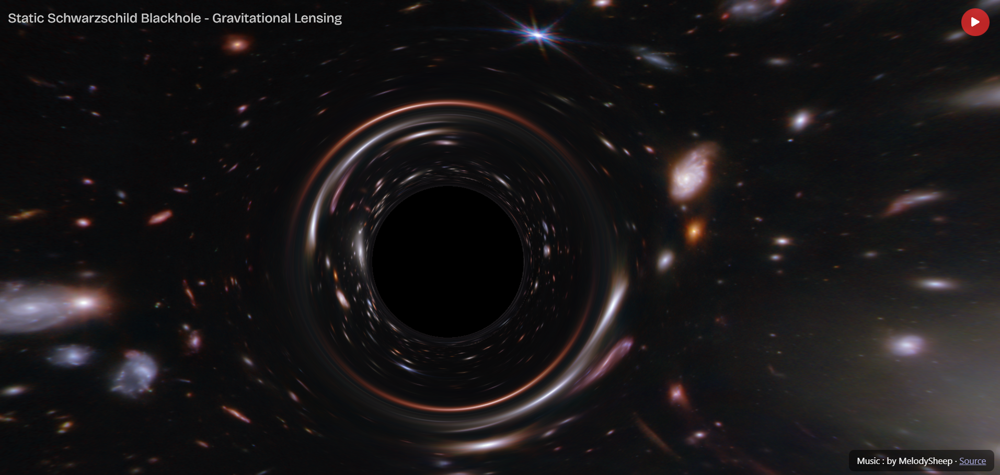

#  Black Hole Gravitational Lensing Simulation

A real-time visualization of gravitational lensing around a Schwarzschild black hole, implemented with **React**, **Three.js**, and **GLSL fragment shaders**. This project simulates how light bends in the strong gravitational field of a black hole, producing the iconic "Einstein ring" and warped starfield behind it.

## Demo Screenshot

##  Live Demo

[👉 View it live](https://your-live-demo-url.com) (hosted on Vercel)

## 📸 Features

- Real-time GPU rendering using GLSL fragment shaders
- Backward ray tracing from screen pixels through Schwarzschild geometry
- Accretion disk distortion and photon ring visualization

## Tech Stack

- [React](https://reactjs.org/)
- [Three.js](https://threejs.org/)
- [React Three Fiber](https://github.com/pmndrs/react-three-fiber)
- [GLSL Fragment Shader](https://thebookofshaders.com/)
- [Vite](https://vitejs.dev/) for lightning-fast development

##  Acknowledgments
- Shader adapted from a shader on shader toys by aroussel
- Music credits : MelodySheep 

 📜 License
MIT © 2025 [@Messiers87]
